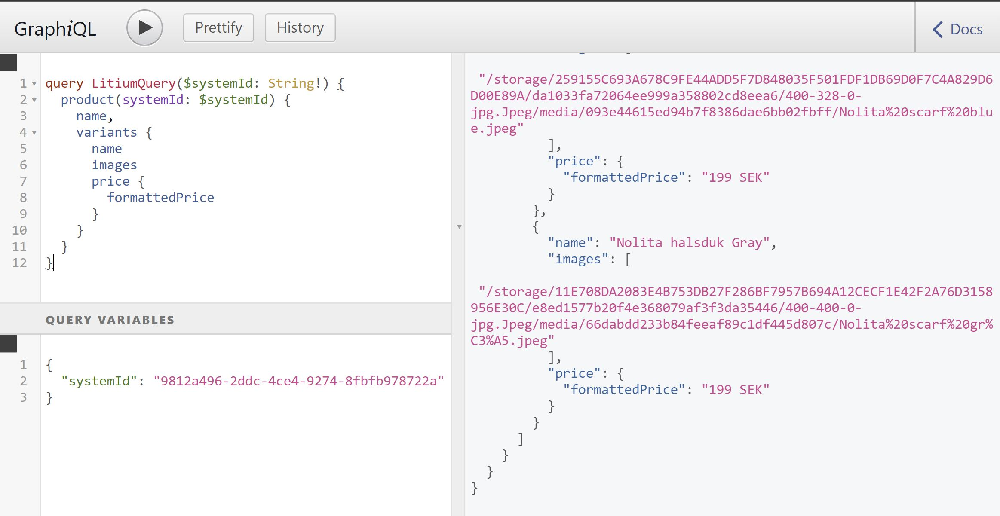
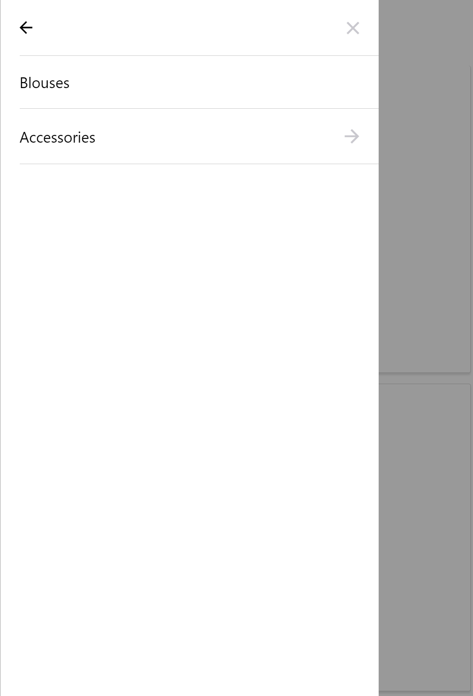

# Litium.GraphQL
 Demonstrate how to query data in Litium using GraphQL
 


## Discalimer
This is only to show the idea of how to integrate GraphQL to Litium. It should not be used in production.

## Installation
The project is built against Litium 7.2.3 but should work with other versions. `Litium.Accelerator` and `Litium.Accelerator.Mvc`
have been stripped out unnecessary code.

To install, add a project reference from `Litium.Accelerator.Mvc` to `Litium.GraphQL`, and add the following code to `Web.config`:

```
  <location path="graphql">
    <system.webServer>
      <handlers>
        <add name="Owin" verb="" path="*" type="Microsoft.Owin.Host.SystemWeb.OwinHttpHandler, Microsoft.Owin.Host.SystemWeb" />
      </handlers>
    </system.webServer>
  </location>
```

Then open a browser, navigate to http://localhost/graphql to access the GraphiQL interface.

## Mobile application
The sample includes also a sample mobile application, under `Litium.GraphQL.mobile` folder, which was built by Expo. To install dependencies, execute:

```
yarn install
```

Remember to change `./src/server.js` to update the `Host` variable to point to the correct server.
To try it out on the browser, execute:

```
yarn run web
```

To test it on Android simulator:

```
yarn run android
```

To try it on iOS simulator on Mac:

```
yarn run ios
```

More info about Expo: https://docs.expo.io/versions/latest/

## Screenshots



